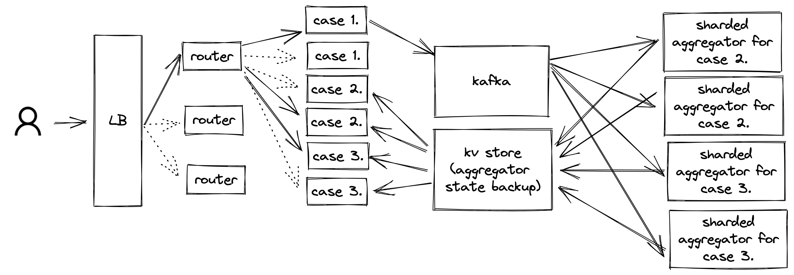
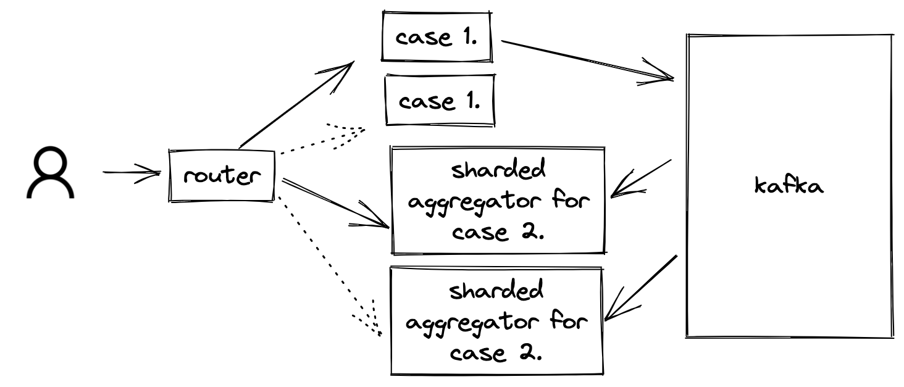

# Allezon Analytics Platform

## Usage
```shell
make
```

## Solution idea
Idea was to build a distributed system illustrated by the diagram below.

Lifecycle of a request is as follows:
1. Request gets to the Load Balancer.
2. Load balancer forwards the request to a Router.
3. Router redirects request to a node specialised in that use case.

Then, depending on the use case:
#### Use case 1.
4. `user_tag` gets put into a Kafka topic. This way, we can acknowledge the request was received ASAP and we don't have to wait for it to be processed.
#### Use case 2.
5. Specialized "aggregator" workers retrieve batches of `user_tag` from Kafka and aggregate them into a state.
    - State here means a list of last 200 events of each type for each user.
    - Aggregators are sharded by `cookie` so that each aggregator is only responsible for a part of the state.
6. Aggregators periodically write their state to a database.
7. Nodes responsible for answering external queries periodically query the database and answer queries based on that.
#### Use case 3.
Same as Use case 2. - only definition of a "state" and "aggregation" changes. By keeping those abstract, we can reuse the code.

## Current state of the solution
The solution is not complete. It is not distributed (run only on single node) and it's missing:
- Key-value store for storing the state,
- Case 3,
- Dedicated nodes for answering case 2:
  - Currently aggregator fulfills this role.

